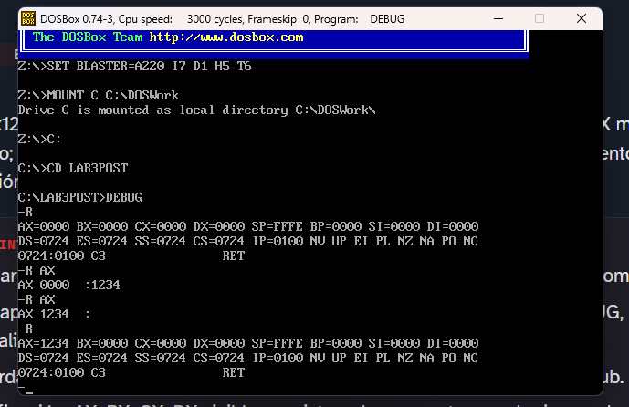
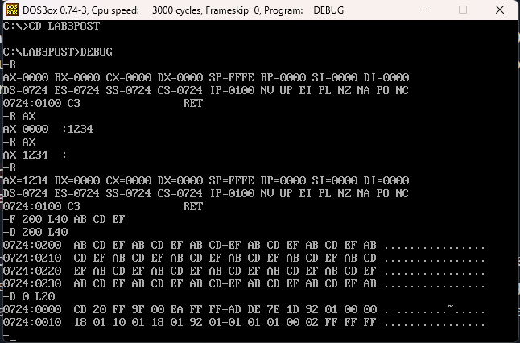
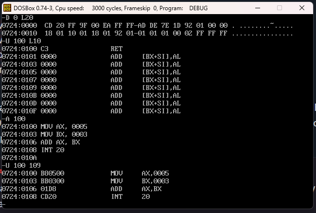
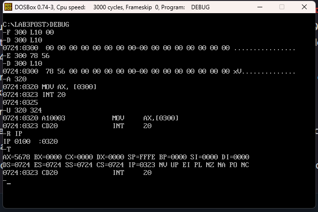
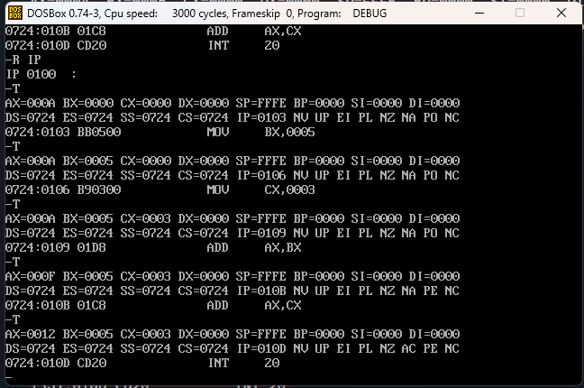
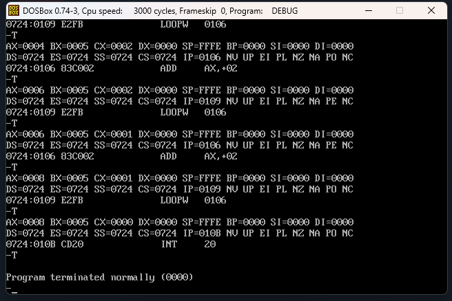
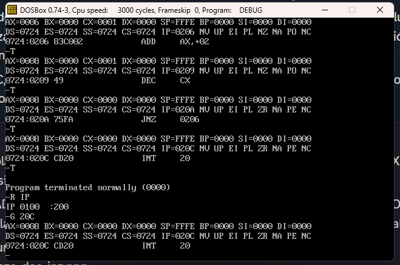

# Alferez-post1-u3

Laboratorio guiado de la Unidad 3 (Arquitectura de Computadores), ejecutado en DOSBox con el depurador DEBUG. El repositorio reúne las dos partes del laboratorio: las capturas de cada checkpoint en `capturas/` y la documentación de comandos, trazas y decisiones técnicas en este README.

## Descripción de las partes

**Parte 1 – Exploración con DEBUG.** El estudiante configura DOSBox, inspecciona el estado inicial de los registros con R, rellena y vuelca memoria con F y D, desensambla código con U, ensambla programas con A y modifica memoria puntualmente con E. Además, verifica una instrucción con direccionamiento directo a memoria (`MOV AX,[0300]`).

**Parte 2 – Ensamblado y ejecución paso a paso.** El estudiante ensambla tres programas con A (suma, bucle con LOOP y bucle equivalente con DEC/JNZ), los ejecuta instrucción a instrucción con T registrando tablas de traza, analiza la codificación en código máquina y usa G como alternativa de verificación rápida.

## Comandos DEBUG utilizados

| Comando | Función | Parte |
|---|---|---|
| `R` / `R reg` | Muestra o modifica registros (AX, IP) | 1 y 2 |
| `F` | Rellena un rango de memoria con un patrón | 1 |
| `D` | Vuelca memoria en hexadecimal y ASCII | 1 y 2 |
| `E` | Escribe bytes puntuales en memoria | 1 |
| `U` | Desensambla bytes a mnemónicos | 1 y 2 |
| `A` | Ensambla instrucciones directamente en memoria | 1 y 2 |
| `T` | Ejecuta una instrucción y muestra el estado | 1 y 2 |
| `G` | Ejecuta a velocidad completa hasta una dirección | 2 |

Las instrucciones LOOP, DEC y JNZ se emplean dentro de los programas de la Parte 2.

# Parte 1

En la salida del comando D (Dump) de DEBUG, la primera columna muestra la dirección de memoria en formato segmento:desplazamiento donde comienzan los datos de cada fila. La segunda columna contiene los datos almacenados en memoria representados en hexadecimal, normalmente 16 bytes por línea. La tercera columna muestra la representación ASCII de esos mismos bytes cuando los caracteres son imprimibles; los que no lo son aparecen como puntos (.). En resumen, la salida permite ver simultáneamente dónde están los datos, su valor hexadecimal y su equivalente ASCII.

## Observaciones de los checkpoints de la Parte 1

**Checkpoint 1 – Registros** (`capturas/CP1_registros.png`)

Con `R`, el estudiante observa AX, BX, CX y DX en 0000, SP en FFFE, los cuatro registros de segmento con el mismo valor (0724, el segmento del PSP) e IP en 0100. Con `R AX` carga 1234 en AX y comprueba que los demás registros no cambian, es decir, que la modificación es selectiva.

**Checkpoint 2 – Volcado de memoria** (`capturas/CP2_volcado_memoria.png`)

Tras `F 200 L40 AB CD EF`, el comando `D 200 L40` muestra el patrón AB CD EF repitiéndose cíclicamente en las 4 filas. La columna ASCII solo muestra puntos porque esos bytes no son imprimibles. En `D 0 L20` los dos primeros bytes del PSP son CD 20, es decir, `INT 20`.

**Checkpoint 3 – Ensamblado y desensamblado** (`capturas/CP3_ensamblado_desensamblado.png`)

Con `A 100` y `U 100 109` se confirma la codificación: `MOV AX,0005` = B8 05 00, `MOV BX,0003` = BB 03 00, `ADD AX,BX` = 03 C3 e `INT 20` = CD 20, para un total de 10 bytes. Los inmediatos se almacenan en formato little-endian: el byte menos significativo ocupa la dirección más baja (0005 se guarda como 05 00).

**Checkpoint 4 – Memoria y direccionamiento directo** (`capturas/CP4_memoria_direccionamiento.png`)

Tras `F 300 L10 00`, `E 300 78 56` modifica únicamente los dos primeros bytes (0724:0300 y 0724:0301), lo que confirma el segundo `D 300 L10`. Leídos como palabra little-endian, 78 56 equivalen a 0x5678. Con `A 320`, el comando `MOV AX,[0300]` se codifica como A1 00 03 y, al ejecutarlo con `T`, AX pasa a valer 0x5678.

## Parte 1, Paso 12: Verificación no destructiva de una escritura en memoria

El estudiante determina que el comando correcto para confirmar la escritura del Paso 11 es D, porque es el único de los cuatro que consulta el estado sin poder alterarlo. Invocar E 300 sin la lista de bytes no es seguro: el DEBUG entra en modo interactivo, muestra el valor actual del primer byte y espera una tecla. Cualquier valor tecleado por descuido sobrescribe esa posición, de modo que la verificación podría corromper el dato que se quiere comprobar. En el Paso 11, en cambio, E recibió la lista completa (78 56) y terminó de inmediato, sin ofrecer esa posibilidad de error. F tampoco sirve, aunque opere sobre un rango como D, porque su función es escribir: repite un patrón sobre todo el rango y sobrescribiría los bytes 78 56 que se desea verificar. R no muestra la memoria, así que no permite comprobar nada sobre DS:0300, y con un nombre de registro (por ejemplo R AX) también permite modificar su valor. D solo lee los bytes del rango indicado y los presenta en hexadecimal y ASCII, sin escribir en memoria ni cambiar registros. Esa propiedad es la que se necesita aquí: el estudiante puede repetir D 300 L10 las veces que haga falta y comprobar que 78 56 siguen en 0724:0300 y 0724:0301 y que los 14 bytes restantes siguen en 00, con la certeza de que la propia verificación no alteró el estado del programa.

## Parte 1, Paso 14: Modo de direccionamiento inmediato vs. directo a memoria

El estudiante determina que el direccionamiento directo a memoria, MOV AX,[0300] (A1 00 03), es el que requiere un ciclo adicional de acceso al bus. Ambas instrucciones ocupan 3 bytes, así que su costo de búsqueda (fetch) es el mismo. La diferencia está en el operando fuente. En MOV AX,0005 (B8 05 00), el valor 0x0005 viaja dentro del flujo de instrucción y llega al procesador junto con el opcode, sin ningún acceso posterior. En MOV AX,[0300], los bytes 00 03 solo contienen una dirección, no el dato. El procesador debe resolver DS:0300 y realizar una lectura adicional en memoria para obtener el valor, lo que añade un acceso al bus que el modo inmediato no necesita. El estudiante preferiría el direccionamiento directo cuando el objetivo no es la velocidad sino leer un valor que puede cambiar en tiempo de ejecución, como los bytes 78 56 escritos con E en el Paso 11. Con el modo inmediato, el valor queda fijado en el código al ensamblar, y cambiarlo exigiría reensamblar la instrucción o modificar sus bytes. Con el modo directo, la instrucción permanece igual y siempre lee el contenido actual de DS:0300, que aquí resulta en AX = 0x5678. Con U, sin ejecutar nada, el estudiante confirma qué codificación produjo cada comando A. MOV AX,0005 aparece como B80500, con el operando sin corchetes, mientras que MOV AX,[0300] aparece como A10003, con corchetes que indican acceso a memoria. Como U solo desensambla, la comprobación no altera registros ni memoria.

# Parte 2 
## Checkpoint 1: Tabla de traza del programa de suma

| # | Instrucción | AX | BX | CX | IP siguiente | ZF | CF | SF |
|---|-------------|------|------|------|--------------|---------|---------|---------|
| 1 | MOV AX,000A | 000A | 0000 | 0000 | 0103 | 0 (NZ) | 0 (NC) | 0 (PL) |
| 2 | MOV BX,0005 | 000A | 0005 | 0000 | 0106 | 0 (NZ) | 0 (NC) | 0 (PL) |
| 3 | MOV CX,0003 | 000A | 0005 | 0003 | 0109 | 0 (NZ) | 0 (NC) | 0 (PL) |
| 4 | ADD AX,BX   | 000F | 0005 | 0003 | 010B | 0 (NZ) | 0 (NC) | 0 (PL) |
| 5 | ADD AX,CX   | 0012 | 0005 | 0003 | 010D | 0 (NZ) | 0 (NC) | 0 (PL) |

## Checkpoint 2: Tabla de traza del programa con bucle LOOP

| Iteración | Instrucción | AX después | CX después | IP siguiente | ¿LOOP salta? |
|-----------|-------------|------------|------------|--------------|--------------|
| Inicio | MOV AX,0000 | 0000 | 0003 | 0103 | N/A |
| Inicio | MOV CX,0004 | 0000 | 0004 | 0106 | N/A |
| 1 | ADD AX,+02 | 0002 | 0004 | 0109 | N/A |
| 1 | LOOPW 0106 | 0002 | 0003 | 0106 | Sí |
| 2 | ADD AX,+02 | 0004 | 0003 | 0109 | N/A |
| 2 | LOOPW 0106 | 0004 | 0002 | 0106 | Sí |
| 3 | ADD AX,+02 | 0006 | 0002 | 0109 | N/A |
| 3 | LOOPW 0106 | 0006 | 0001 | 0106 | Sí |
| 4 | ADD AX,+02 | 0008 | 0001 | 0109 | N/A |
| 4 | LOOPW 0106 | 0008 | 0000 | 010B | No |
| Fin | INT 20 | 0008 | 0000 | - | N/A (Program terminated normally) |

## Parte 2, Paso 8: Análisis del código máquina del bucle LOOP

Con `D CS:100 L0D` el estudiante vuelca los 13 bytes del programa del Paso 5:

| Dirección | Bytes | Instrucción | Tamaño |
|---|---|---|:---:|
| 0100 | B8 00 00 | `MOV AX,0000` | 3 |
| 0103 | B9 04 00 | `MOV CX,0004` | 3 |
| 0106 | 05 02 00 | `ADD AX,0002` | 3 |
| 0109 | E2 FB | `LOOP 0106` | 2 |
| 010B | CD 20 | `INT 20` | 2 |

Las instrucciones tienen longitud variable: tres ocupan 3 bytes y dos ocupan 2, para un total de 13 bytes. Los inmediatos de 16 bits están en little-endian (`0004` se guarda como 04 00). En `LOOP`, E2 es el opcode y FB es un desplazamiento relativo con signo (−5), calculado como destino menos la dirección de la instrucción siguiente: 0106 − 010B = −5 = FB. Esto equivale a saltar a 010B − 5 = 0106. Los saltos cortos usan 8 bits con signo, por lo que su alcance es de aproximadamente ±127 bytes.

Nota: en el desensamblado de DOSBox, `LOOP` aparece como `LOOPW` (variante de 16 bits que usa CX como contador). El opcode es el mismo, E2.

## Decisión técnica - Parte 2, Paso 10: selección del mecanismo de control de bucle (LOOP vs. DEC/JNZ)

Para este bucle contador simple, el estudiante recomienda LOOP. En términos de código máquina, `LOOP 0106` se codifica como `E2 FB` y ocupa 2 bytes, mientras que `DEC CX` + `JNZ 0206` se codifican como `49 75 FA` y ocupan 3 bytes, es decir, un 50 % más de código para el mismo efecto observable. En términos de ejecución, LOOP combina el decremento de CX y el salto condicional en una sola instrucción, por lo que el procesador extrae (fetch) y ejecuta 2 instrucciones por iteración (ADD + LOOP), frente a las 3 de la versión manual (ADD + DEC + JNZ). Esta diferencia se confirmó en las trazas: 11 invocaciones de T con LOOP frente a 15 con DEC/JNZ, una instrucción adicional por cada una de las 4 iteraciones. Como CX no se usa para nada más dentro del cuerpo del bucle, no hay razón para pagar ese costo extra.

El estudiante preferiría DEC/JNZ cuando la condición de salida no fuera simplemente "CX ≠ 0" sino el resultado de una comparación evaluada con CMP, ya que JNZ puede encadenarse a cualquier operación que modifique ZF, mientras que LOOP depende exclusivamente de CX. También lo elegiría si el cuerpo del bucle necesitara usar CX para otra operación aritmética, o si hiciera falta contar con otro registro, porque DEC puede operar sobre cualquiera. Además, DEC deja ZF y las demás banderas actualizadas tras cada iteración (excepto CF), lo que permite consultarlas, mientras que LOOP no modifica ninguna bandera.

Para verificar cuál versión ocupa menos bytes sin ejecutar nada, el estudiante usaría `U 100 10D` y `U 200 20D`, y compararía las direcciones y los bytes de cada instrucción. El bloque de control de LOOP (`E2 FB`) ocupa 2 bytes, y el de DEC/JNZ (`49` + `75 FA`) ocupa 3, lo que se confirma al restar las direcciones inicial y final de cada programa.

## Decisión técnica (Parte 2, Paso 12): comando de verificación para bucles de muchas iteraciones (T vs. G)

Para verificar el resultado final de un bucle con CX = 0x0064, el estudiante utiliza `G 20C` en lugar de repetir T. Con el mecanismo DEC/JNZ, el bucle ejecutaría 3 instrucciones por iteración, lo que equivale a 303 invocaciones de T (2 de inicialización + 100 × 3 + 1 de terminación), una cantidad impracticable y propensa a errores de transcripción. G, en cambio, ejecuta el programa a velocidad completa y se detiene en el punto de interrupción CS:020C con un solo comando. El costo de esa comodidad es la pérdida de granularidad: G solo muestra el estado de los registros y las banderas en el punto de parada, por lo que no revela los valores de AX, CX, IP ni ZF en las iteraciones intermedias, ni permite identificar en qué iteración ocurriría un error lógico.

T fue realmente necesario en los Pasos 4, 7 y 11, porque en los tres la tarea consistía en completar una tabla de traza que exige registrar, después de cada instrucción, el estado de AX, CX, IP y las banderas. Esa información intermedia no la entrega G. En particular, el conteo comparado de 11 invocaciones con LOOP frente a 15 con DEC/JNZ solo pudo obtenerse porque T avanza exactamente una instrucción por vez.

Tras ejecutar `G 20C`, el estudiante confirmaría únicamente el valor final de AX con `R AX`, que muestra `AX 0008` en una sola línea. Cuando aparece el prompt `:`, presiona Enter sin escribir ningún valor para dejar el registro sin modificar. De este modo comprueba AX = 0x0008 sin haber observado ningún paso intermedio.

## Checkpoint 3: tabla de traza del bucle equivalente con DEC/JNZ

Programa ensamblado en `0724:0200`. El símbolo `—` indica que el registro no cambió respecto a la fila anterior.

| Iteración | Instrucción | AX después | CX después | IP siguiente | ¿JNZ salta? |
|:---:|---|:---:|:---:|:---:|:---:|
| Init | `MOV AX,0000` | 0000 | — | 0203 | N/A |
| Init | `MOV CX,0004` | 0000 | 0004 | 0206 | N/A |
| 1 | `ADD AX,0002` | 0002 | 0004 | 0209 | N/A |
| 1 | `DEC CX` | 0002 | 0003 | 020A | N/A |
| 1 | `JNZ 0206` | 0002 | 0003 | 0206 | Sí (ZF=0) |
| 2 | `ADD AX,0002` | 0004 | 0003 | 0209 | N/A |
| 2 | `DEC CX` | 0004 | 0002 | 020A | N/A |
| 2 | `JNZ 0206` | 0004 | 0002 | 0206 | Sí (ZF=0) |
| 3 | `ADD AX,0002` | 0006 | 0002 | 0209 | N/A |
| 3 | `DEC CX` | 0006 | 0001 | 020A | N/A |
| 3 | `JNZ 0206` | 0006 | 0001 | 0206 | Sí (ZF=0) |
| 4 | `ADD AX,0002` | 0008 | 0001 | 0209 | N/A |
| 4 | `DEC CX` | 0008 | 0000 | 020A | N/A |
| 4 | `JNZ 0206` | 0008 | 0000 | 020C | No (ZF=1) |
| Fin | `INT 20` | 0008 | 0000 | — | N/A |

Verificación: AX = 0x0008 (8 decimal) al finalizar la traza con T y también con el resultado de `G 20C`.

## Conteo comparado de instrucciones ejecutadas: LOOP vs. DEC/JNZ

| Aspecto | Bucle con LOOP (Paso 5, `0100`) | Bucle con DEC/JNZ (Paso 9, `0200`) |
|---|---|---|
| Instrucciones de control | `LOOP 0106` (`E2 FB`) | `DEC CX` (`49`) + `JNZ 0206` (`75 FA`) |
| Bytes de control | 2 | 3 |
| Tamaño total del programa | 13 bytes | 14 bytes |
| Instrucciones por iteración | 2 (ADD + LOOP) | 3 (ADD + DEC + JNZ) |
| Invocaciones de T | 2 + 4 × 2 + 1 = **11** | 2 + 4 × 3 + 1 = **15** |
| Resultado final | AX = 0x0008, CX = 0x0000 | AX = 0x0008, CX = 0x0000 |

Ambos mecanismos son semánticamente equivalentes, ya que producen el mismo resultado final. La versión con DEC/JNZ ejecuta 4 instrucciones adicionales, exactamente una por cada una de las 4 iteraciones, correspondientes a la instrucción de control extra que necesita frente a LOOP. Esta diferencia es coherente con los bytes de código: 14 bytes frente a 13.

## Observaciones de los checkpoints de la Parte 2

**Checkpoint 1 – Traza de suma** (`capturas/CP1_traza_suma.png`)

Las instrucciones MOV no modifican las banderas, que permanecen en NZ, NC y PL durante toda la traza. AX pasa de 000A a 000F tras sumar BX y a 0012 tras sumar CX, con lo que se verifica 18 decimal.

**Checkpoint 2 – Traza con LOOP** (`capturas/CP2_traza_loop.png`)

CX decrementa de 4 a 0 y LOOP salta a 0106 en las tres primeras iteraciones. En la cuarta no salta (CX = 0000) y continúa en 010B, con AX = 0008.

**Checkpoint 3 – Traza con DEC/JNZ y demostración con G** (`capturas/CP3_traza_dec_jnz.png`)

JNZ salta mientras ZF = 0 y deja de saltar cuando DEC deja CX en 0 (ZF = 1). El resultado coincide con el de LOOP (AX = 0008). `G 20C` entrega el mismo resultado sin mostrar pasos intermedios.

**Checkpoint 4 – Repositorio.** El repositorio contiene este README, la carpeta `capturas/` con las siete capturas y el historial de commits de ambas partes.

## Conclusiones

El laboratorio permitió comprobar que, en modo real, el procesador interpreta como instrucción cualquier byte al que apunte CS:IP, y que DEBUG permite observar esa correspondencia directamente entre mnemónicos y código máquina. El estudiante distinguió entre comandos de solo lectura (D, U) y de escritura (F, E, A), y entre direccionamiento inmediato y directo a memoria. Comparó LOOP con DEC/JNZ: ambos producen el mismo resultado (AX = 0x0008), pero LOOP ocupa 2 bytes de control frente a 3 y ejecuta 11 instrucciones en la traza frente a 15. Finalmente, contrastó T (granularidad instrucción por instrucción, necesaria para las tablas de traza) con G (verificación rápida del resultado final), y concluyó que cada uno responde a una necesidad distinta.
